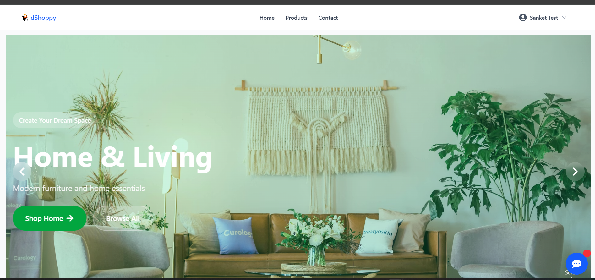
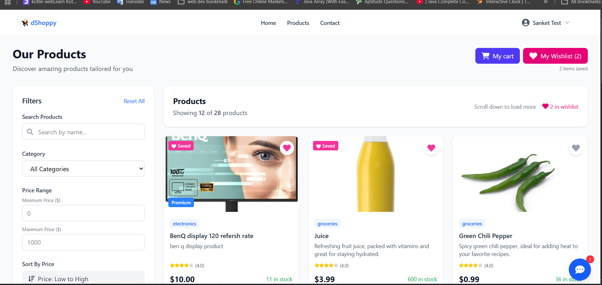
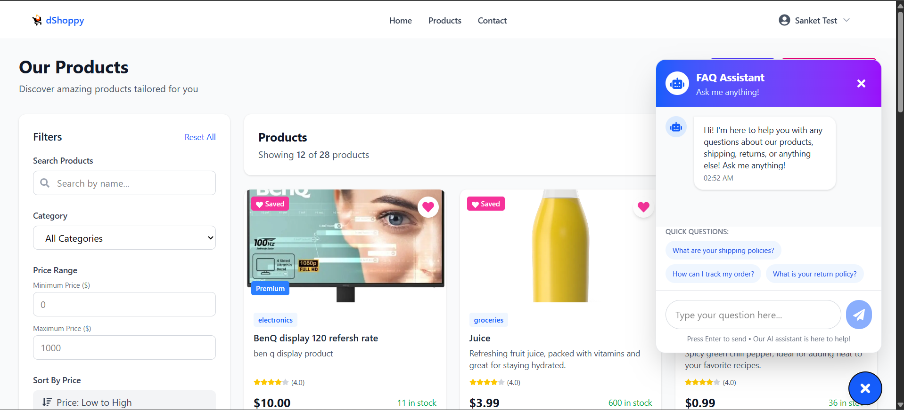
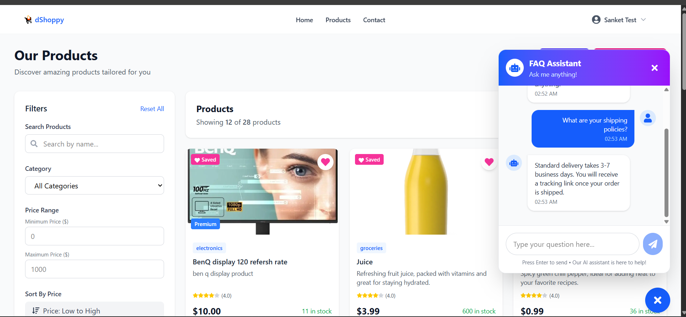
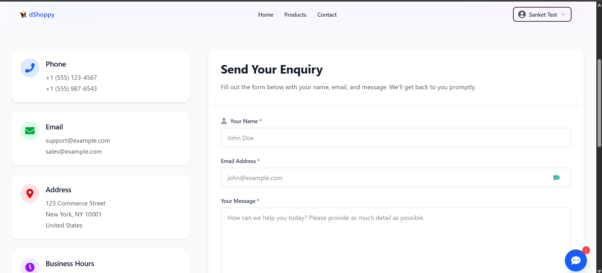
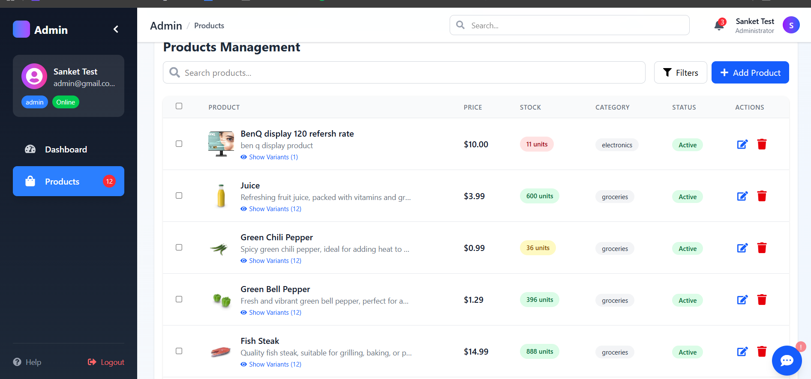
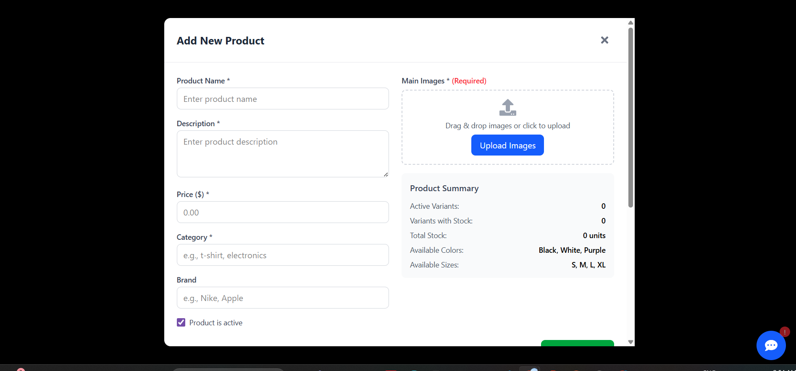

# 🛒 Full Stack Ecommerce Website – MERN Stack

## 🎥 Project Demo Video

📸 Project Screenshots

Below are some screenshots showcasing key features of the application. All images are located inside the assets/ folder.

🏠 Home Page



🛍️ Product Listing


❓ FAQ Section – 1


❓ FAQ Section – 2


📩 Enquiry Page



🛠️ Admin – Product Management



➕ Admin – Add Product


## 🧭 Approach

The project is divided into **two main parts**:

### 🖥️ Backend Server

The backend is developed using **Node.js** and **Express.js**. It exposes a comprehensive set of **RESTful APIs** connected to **MongoDB**, handling all core ecommerce functionalities such as authentication, product management, Product syncing,cart operations, chatbot, and enquiries.

### 💻 Frontend Client

The frontend is built using **React.js**, which consumes backend APIs to provide a seamless user experience for customers and admins. It includes product browsing, cart & checkout flow, authentication, and an admin dashboard.

---

## 📋 Project Overview

A complete **MERN Stack Ecommerce Platform** featuring:

- **Product Sync Cron Job** – Auto-fetch & sync products from external APIs
- **Admin Dashboard** – Full product & order management
- **Product Variations** – Color & size support
- **Complete Ecommerce Flow** – Cart, wishlist, checkout, auth
- **Live Chatbot** – Automated FAQ responses
- **Enquiry System** – Contact form with email notifications

---

## ✨ Key Features

### 🔄 Product Sync API

- Fetch products automatically from external APIs
- Save products to database without manual entry
- Smart duplicate prevention
- Scheduled product synchronization

### 👨‍💼 Admin Dashboard

- Add, Update, Delete products (Single & Bulk)
- Manage product variations (Colors & Sizes)
- Real-time product updates
- Order management system

### 🛍️ Ecommerce Features

- Product listing with search & filters
- Product details with variations
- Cart & Wishlist functionality
- Secure checkout (Auth required)
- Responsive and modern UI

### 📞 Customer Support

- Enquiry form with email notifications
- Live chatbot for FAQs
- Contact management system

---

## 🛠️ Tech Stack

### Backend

- Node.js & Express.js
- MongoDB & Mongoose ODM
- JWT Authentication
- Bcrypt (Password hashing)
- Nodemailer (Email service)
- CORS (Security)

### Frontend

- React.js
- React Router DOM
- Context API (State management)
- Axios (API requests)
- Tailwind CSS / Material UI
- React Hot Toast (Notifications)

### Development & Deployment

- Git & GitHub
- Postman (API testing)
- Environment variables
- Centralized error handling

---

---

## ⚙️ Setup Instructions

### 🧩 Prerequisites

- Node.js v18+
- MongoDB connection URL
- Git installed

---

### 🖥️ Backend Setup

```bash
cd backend
copy .env.example to .env
```

```bash
npm install
npm run dev
```

Backend URL: `http://localhost:8000`

---

### 💻 Frontend Setup

```bash
cd frontend
cerate .env and add this belowed line
```

```env
VITE_API_URL=http://localhost:8000/api/v1

```

```bash
npm install
npm run dev
```

Frontend URL: `http://localhost:5173`

---

## 🚀 Future Enhancements

- Payment Gateway Integration (Razorpay / Stripe)
- Role-based access control
- Redis caching
- Admin analytics dashboard

---

## 📜 License

This project is for learning and portfolio purposes.
